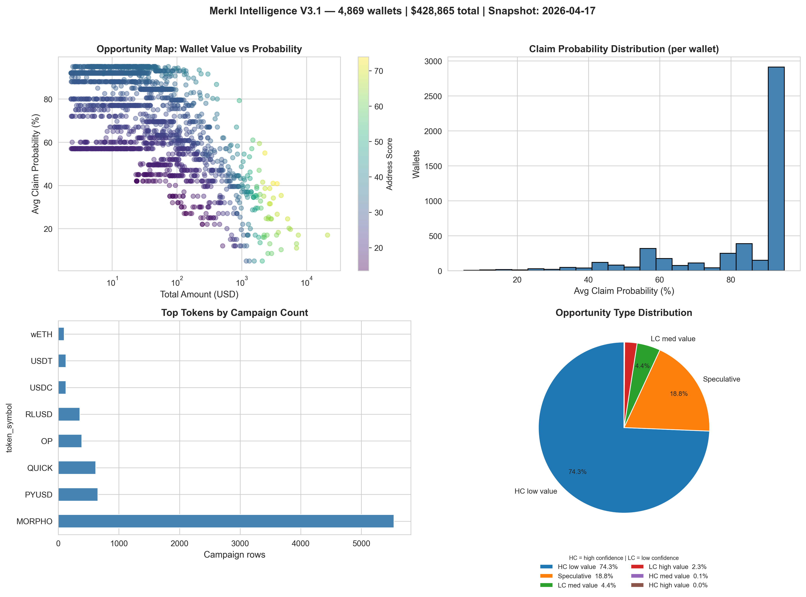

# 💎 Merkl Protocol Intelligence Dataset

**Scored, de-duplicated intelligence** covering unclaimed Merkl protocol rewards — with behavioral scoring, wallet-level aggregation, and native token pricing.



[](https://github.com)
[](https://github.com)
[](https://github.com)
[](https://github.com)
[](https://github.com)
[](LICENSE.md)

---

## 🎯 What Is This?

A **3-layer scored intelligence dataset** of **4,602 unique wallets** with unclaimed rewards from the [Merkl protocol](https://merkl.xyz) (by Angle Labs) — a DeFi incentive distribution system used by leading protocols including Morpho, Pendle, and others.

**Total unclaimed value: ~$308,162 USD across 6,594 campaigns**  
**Snapshot date: 2026-04-13 · ETH @ $2,184.08**

This is NOT a raw address dump. Each wallet is processed through a scoring pipeline that produces:

- ✅ **`address_score`** — composite wallet-level score (0–100) based on ETH amount, claim probability, campaign count, and diversification
- ✅ **`tokens_breakdown`** — `"MORPHO:1.23ETH; PYUSD:0.45ETH"` — full portfolio in one field
- ✅ **`avg_claim_probability`** — heuristic prediction of staying unclaimed 30 days
- ✅ **Whale flagging** — 111 wallets hold >0.3 ETH (~55% of total value)
- ✅ **Diversification analysis** — multi-token / multi-chain wallet profiling
- ✅ **Native token USD pricing** — MORPHO, OP, RLUSD priced at market rates, not ETH-conversion

---

## 📊 Dataset at a Glance

| Metric | Value |
|--------|-------|
| **Unique wallets** | 4,602 |
| **Total campaigns** | 6,594 |
| **Total value** | ~$308,162 USD |
| **Total ETH** | 141.10 ETH |
| **Whale wallets (>0.3 ETH)** | 111 wallets — 55.1% of total value |
| **High probability (>60%)** | 3,729 wallets (81%) |
| **Very high probability (>80%)** | 2,989 wallets (65%) |
| **Diversified wallets** | 356 (7.7% — multi-token) |
| **Avg campaigns per wallet** | 1.43 |
| **Unique blockchains** | 8 |
| **Unique token types** | 20 |
| **Primary token** | MORPHO (3,851 campaigns) |
| **Primary chain** | Base (3,242 campaigns) |

### Top Tokens by Campaign Count

| Token | Campaigns | Notes |
|-------|-----------|-------|
| MORPHO | 3,851 | Governance token — low claim motivation |
| PYUSD | 699 | PayPal stablecoin — higher claim rate |
| QUICK | 608 | Small-cap governance |
| OP | 397 | Optimism governance |
| RLUSD | 384 | Ripple stablecoin |
| USDT | 329 | Stablecoin |

### Value Distribution

| Segment | USD Value |
|---------|-----------|
| Top 10 wallets | $39,617 |
| Top 100 wallets | $162,152 (53% of total) |
| Top 500 wallets | $251,536 (82% of total) |
| Whale wallets (111) | $169,848 (55% of total) |

---

## 🏗️ Three Data Layers

The dataset is structured in three complementary layers:

| Layer | File | Rows | Description |
|-------|------|------|-------------|
| **Wallet** (PRIMARY) | `merkl_v3_address_only.csv` | 4,602 | **1 row per wallet.** De-duplicated. Full portfolio summary. |
| **Token drill-down** | `merkl_v3_address_token.csv` | varies | 1 row per wallet+token+chain combination. |
| **Campaign detail** | `merkl_v3_full_detail.csv` | 6,594 | Raw per-campaign rows. Same wallet may repeat. |

> **Note:** `merkl_v3_full_detail.csv` contains multiple rows per wallet (one per campaign). This is expected. Always use `merkl_v3_address_only.csv` as the primary ranked view.

### Key Fields in the Wallet Layer (`address_only`)

| Field | Description |
|-------|-------------|
| `rank` | Rank by `total_amount_eth` DESC |
| `address` | Full wallet address |
| `total_amount_eth` | Sum across all tokens, chains, campaigns |
| `total_amount_usd` | USD using native token price where available |
| `address_score` | Composite score 0–100 (ETH×50 + prob×0.3 + campaigns + diversity) |
| `avg_claim_probability` | Average likelihood of staying unclaimed 30d |
| `tokens_breakdown` | `"MORPHO:1.23ETH; PYUSD:0.45ETH"` — portfolio at a glance |
| `chains_breakdown` | `"Ethereum:1.68ETH; Base:0.12ETH"` |
| `whale_flag` | `yes` if total > 0.3 ETH |
| `is_diversified` | `yes` if holds multiple token types |
| `urgency` | `critical / urgent / important / moderate / low` |
| `profit_tier` | `ultra / premium / high / medium / standard / micro` |
| `opportunity_type` | 6 categories: `[high/low]_confidence_[high/medium/low]_value` |
| `total_campaigns` | Number of distinct campaigns |
| `unique_tokens` | Number of distinct token types |
| `unique_chains` | Number of distinct chains |
| `total_expected_value` | Conservative extractable value estimate (USD) |

---

## 🆓 Free Sample

This repository contains a **representative sample** (~150 wallets) from the **middle segment** of the dataset (score percentiles 20–80 by total ETH).

📁 **File:** [`merkl_v3_sample.csv`](merkl_v3_sample.csv)

**What the sample shows:**
- Full wallet-level structure and all intelligence fields
- `address_short` only — no full addresses or merkl_link
- Middle segment — top-scoring wallets are in paid tiers only

**What it demonstrates:**
- Data quality and field completeness
- Scoring methodology in action
- `tokens_breakdown` and `chains_breakdown` format

---

## 💡 Why Wallets Don't Claim

Understanding *why* these rewards are unclaimed is what makes this dataset useful:

- **Gas economics** — for small positions on Ethereum mainnet, gas cost exceeds reward value
- **Wallet abandonment** — address no longer actively used
- **Token indifference** — governance tokens (MORPHO, QUICK, OP) have low sell motivation
- **Awareness gap** — user participated in a protocol but doesn't track Merkl rewards
- **Rational delay** — waiting for gas prices to drop

The scoring system models these signals into a per-wallet prediction of whether rewards will stay unclaimed.

---

## 🔍 Use Cases

### For DeFi Protocol Teams
- **Competitive benchmarking** — claim rates for your incentive programs vs Merkl
- **Re-engagement lists** — identify your own LPs with unclaimed rewards
- **Incentive design** — understand which tokens get claimed vs abandoned
- **Filter by token:** `tokens_breakdown contains 'MORPHO'` → your MORPHO campaign participants

### For Blockchain Researchers
- **Behavioral finance** — gas cost thresholds and claim psychology in DeFi
- **ML training data** — labeled wallet behavior dataset with rich features
- **Time-series analysis** — combine monthly updates to track claim rate decay

### For On-Chain Analysts
- **Market inefficiency mapping** — unclaimed rewards = locked supply signal
- **Whale profiling** — 111 wallets hold 55% of value, most not claiming
- **Token supply analysis** — MORPHO unclaimed as circulating supply proxy

---

## 📦 Full Dataset — Paid Tiers

The complete dataset is available in three tiers:

### 🟡 Premium — $149
- `merkl_v3_premium.csv` — Top-500 wallets by total ETH (wallet layer, de-duped)
- `merkl_v3_address_token.csv` — Token drill-down
- `merkl_v3_stats.json` + `merkl_v3_insights.png`
- `data_dictionary.txt`

### 🔴 Full — $249
- `merkl_v3_address_only.csv` — All 4,602 wallets (PRIMARY view)
- `merkl_v3_address_token.csv` — Token breakdown
- `merkl_v3_full_detail.csv` — Campaign-level raw data
- `merkl_v3_stats.json` + `merkl_v3_insights.png`
- `data_dictionary.txt` + `methodology.txt`

### 💎 PRO — $399 ⭐ Best Value
**Everything in Full, plus:**
- `merkl_v3_whales.csv` — 111 whale wallets only (>0.3 ETH)
- `merkl_v3_top200.csv` — Top-200 by `address_score` (most actionable)
- `Merkl_Strategy_Guide_v1.pdf` — 15-page methodology and action framework
- 1 monthly update included
- Priority email support

> Saves 5–10 hours of manual filtering. Focus on the 2.4% of wallets that hold 55% of the value.

**🛒 Get the full dataset:** email to lensreward@gmail.com

---

## 🔬 Methodology

### Scoring is heuristic-based, not black-box ML — fully explainable

**`address_score` (wallet-level, 0–100):**
```
min(total_eth × 50, 50)        # up to 50 pts — ETH amount
+ avg_claim_probability × 0.3  # up to 28.5 pts — probability signal
+ min(n_campaigns × 0.5, 5)    # up to 5 pts — campaign engagement
+ min(n_tokens × 0.5, 3)       # up to 3 pts — diversification
+ max_score × 0.1              # up to 10 pts — best campaign boost
```

**`avg_claim_probability` factors (5–95% scale):**

| Factor | Effect |
|--------|--------|
| Amount < 0.01 ETH | +35 pts (gas exceeds value) |
| Amount > 0.5 ETH | −25 pts (rational to claim) |
| Unclaimed > 180 days | +30 pts |
| MORPHO token | +12 pts (governance, low urgency) |
| Stablecoins (PYUSD, RLUSD) | −8 pts (real $ value) |
| Base / Scroll chain | +10 pts (low-activity L2) |
| Ethereum mainnet | −5 pts |

**Opportunity type classification:**

| Type | Condition |
|------|-----------|
| `high_confidence_high_value` | prob > 70%, amount > 0.1 ETH |
| `high_confidence_medium_value` | prob > 70%, amount > 0.05 ETH |
| `high_confidence_low_value` | prob > 70% |
| `low_confidence_high_value` | amount > 0.2 ETH |
| `low_confidence_medium_value` | amount > 0.05 ETH |
| `speculative` | everything else |

### Known Limitations

- **Snapshot data** — taken 2026-04-13, not real-time
- **Heuristic scoring** — does not track cross-protocol activity
- **USD pricing** — native token price where cached, ETH-conversion otherwise
- **No PII** — wallet addresses only (public blockchain data)

---

## ⚖️ Ethics & Legal

✅ **Public data only** — sourced from Merkl Protocol public API  
✅ **No PII** — wallet addresses are public blockchain data, verifiable on-chain  
✅ **100% verifiable** — every address and amount independently verifiable  

**Appropriate uses:** research, protocol optimization, ML model training, competitive intelligence  
**Not for:** unsolicited contact, spam, or harassment of wallet holders

---

## 📎 Files in This Repository

```
merkl_v3_sample.csv          — free sample (~150 wallets, p20–p80, no full addresses)
merkl_v3_insights.png        — 4-panel intelligence chart
README.md                    — this file
LICENSE.md                   — CC BY-NC-SA 4.0 (sample) / commercial (full dataset)
```

---

## 📬 Contact

Questions about the data, methodology, or custom licensing?  
**Email:** lensreward@gmail.com  
**Twitter/X:** [@YOUR_HANDLE]

---

*Snapshot: 2026-04-13 · Source: Merkl Protocol Public API · Dataset Version: 3.1*  
*ETH price at scan: $2,184.08 · Pipeline: `merkl_pipeline_v3.py`*
